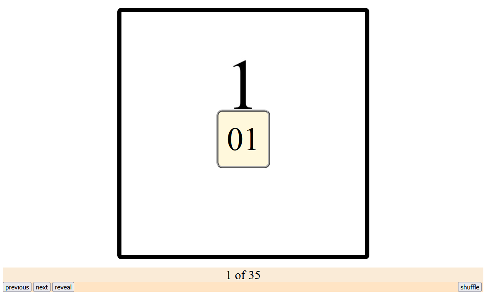

# About **Image Viewer**
**Image Viewer** is:
* two local, flashcard-like, browser-based apps ("Image Viewer Bulk" and "Image Viewer Selectable")
    * Image Viewer Bulk displays an image carousel that has images from the pathnames collected via `setup_image_viewer_bulk.sh`
    * Image Viewer Selectable displays a selection screen which allows the user to select subdirectories. The contents of selected subdirectories are displayed in the image carousel.
* two shell scripts to make those apps functional
    * `setup_image_viewer_bulk.sh`
    * `setup_image_viewer_selectable.sh`

*below: when using image-viewer-selectable.html, a user can select which categories to display*

## 1. Requirements

* Bash
* Browser (has only been run on Firefox 132.0)

## 2. How to Use

1. place ***directories*** with image files in the `image-collections` directory
    * NOTE: if you put your image files directly into `image-collections`, they will not be recorded
1. give your image files user-friendly names; use hyphens instead of spaces
    * pressing the 'reveal' button in the browser will display a name extracted from the filename
        * eg "dog-collar" => "dog collar"
1. ues bash to run the shell script of your choice (bulk vs selectable)
1. use a browser to open the html doc of your choice (bulk vs selectable)

*below: the image "1" has a filename "01"*

## 3. Adding Special Characters (-'")

coming soon!
