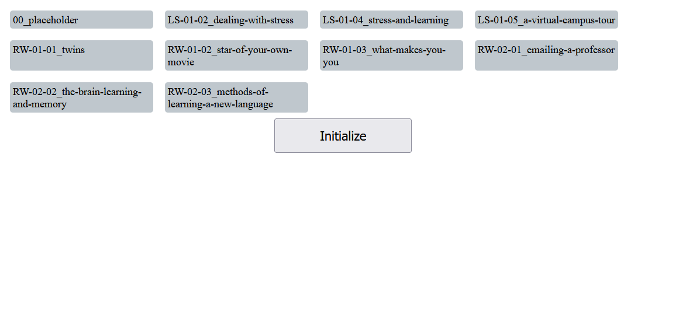
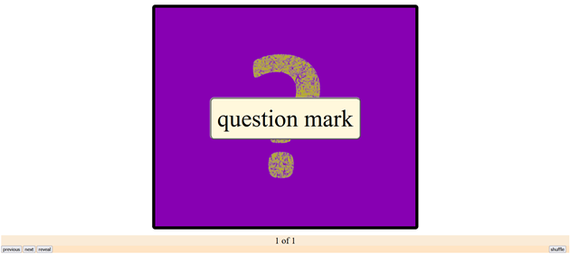

# About **Image Viewer**
***Image Viewer*** is a flashcard-like, browser-based app. It displays a selection screen which allows the user to select subdirectories. After initialization, the contents of selected subdirectories are displayed in the image carousel.

## 1. Requirements

* Bash
* Browser (only Firefox 132.0 has been used)

## 2. How to Use

1. make ***directories*** in the `image-collections` directory
1. place image files in those ***sub-directories***
    * NOTE: if you put your image files directly into `image-collections`, their pathnames will not be recorded
1. give your image files computer-friendly ***and*** user-friendly names
    * use hyphens instead of spaces
    * use descriptive names, i.e. use 'dog.jpg' instead of '2024120109413eeexport.jpg'
    * don't use strange characters like `$ % ^ & , ` etc
    * to add special characters, see ***3. Displaying Special Characters***
1. use bash to run the shell script
    * `$ ./setup_image_viewer.sh`
1. use a browser to open the html file

*note: the image below had a file name of 'question-mark.jpg'; clicking the 'reveal' button displayed a user-friendly version of it, 'question mark'*

## 3. Displaying Special Characters

* use "aaa" to add an apostrophe (')
    * "witchaaas-hat.jpg" -> "witch's hat"
* use "hhh-" to add a hyphen (-)
    * "hearthhh-warming.jpg" -> "heart-warming"
